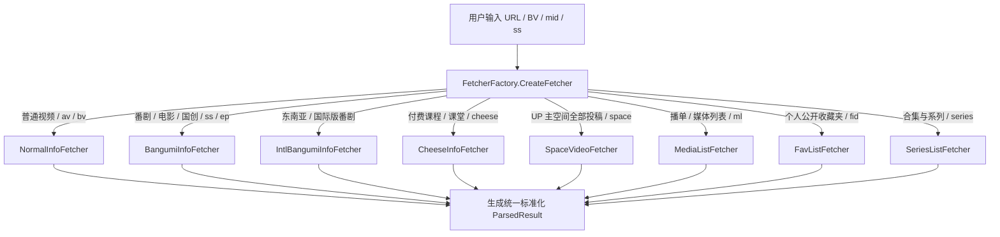

# 内部架构与设计原理 (Architecture & Design)

> 本文档深入剖析 BBDown 的内部代码结构、分层设计、解析工厂模型、原生 Widevine CDM 实现机制以及网络可靠性工程设计。

---

## 1. 整体架构分层

BBDown 采用清晰的分层架构设计，各层职能严格解耦：

```
+-------------------------------------------------------------------+
|                        BBDown (应用与命令行层)                      |
|  - 命令行解析与参数绑定 (Spectre.Console.Cli)                       |
|  - 控制台富文本与动态进度条渲染 (Spectre.Console)                    |
|  - API 服务器 (BBDownApiServer)                                   |
|  - 扩展子命令实现 (Live, Article, Sub, WatchLater, Login, Serve)    |
+-------------------------------------------------------------------+
                                  |
                                  v
+-------------------------------------------------------------------+
|                      BBDown.Core (核心引擎层)                      |
|  - FetcherFactory & IFetcher 责任链资源解析引擎                    |
|  - 视频信息提取与清晰度决策 (Parser / TrackSort)                   |
|  - 原生 C# Widevine CDM 模块 (DRM Decryption)                      |
|  - 分片多线程并发下载引擎 (BBDownDownloadUtil)                      |
|  - 混流与外挂字幕/章节嵌入 (BBDownMuxer - FFmpeg/MP4Box)          |
|  - 弹幕解析与 ASS 转换引擎 (DanmakuUtil)                           |
|  - 网络与可靠性保障 (HTTPUtil / UpowerGuard / 读停滞看门狗)        |
+-------------------------------------------------------------------+
                                  |
                                  v
+-------------------------------------------------------------------+
|                     External Tools (外部依赖层)                    |
|       FFmpeg       |       MP4Box       |       aria2c (可选)      |
+-------------------------------------------------------------------+
```

---

## 2. 资源解析责任链工厂 (`FetcherFactory`)

BBDown 支持解析数十种不同的哔哩哔哩链接形式。系统通过 `IFetcher` 接口与 `FetcherFactory` 抽象工厂实现统一解析：



---

## 3. 原生 C# Widevine CDM 实现原理

为了摆脱对 Python 与 `pywidevine` 庞大运行时的依赖，BBDown 在 `BBDown.Core/DRM/` 中纯手工实现了 Widevine L3 CDM 客户端协议：

1. **WVD 凭据解析 (`WvdDevice.cs`)**：
   - 读取并解析二进制 `device.wvd` 文件，提取 RSA 私钥、Client ID 及设备证书链。
2. **Challenge 构建 (`WidevineCdm.cs`)**：
   - 提取视频 DASH 清单中的 PSSH 数据盒。
   - 使用设备私钥对会话随机数与 PSSH 进行签名，生成符合 Google Widevine 规范的二进制许可证请求（License Challenge）。
3. **许可证握手与解密 (`CkcDecryptor.cs` / `WidevineCrypto.cs`)**：
   - 向 B 站许可证服务器发送 POST 请求并接收 Content Key Context (CKC)。
   - 使用 AES-128-OAEP 解密 CKC 中的内容密钥（Content Key & Key ID）。
   - 对下载的 Sample 级加密分片执行原生的 AES-128-CTR / AES-128-CBC 解密。

---

## 4. 网络高可靠性设计

### 4.1 媒体流读停滞看门狗 (`MediaReadStallTimeout`)
- **设计背景**：当 CDN 节点负载过高或出现半死连接时，TCP 链路可能在握手成功且返回 Response Headers 后发生死锁，此时 `HttpClient.Timeout` 无法约束后续 `ReadAsync` 的阻塞，可能导致工作线程永久挂起。
- **看门狗机制**：BBDown 为媒体读取管道配备了读停滞看门狗计时器（默认 60 秒），一旦检测到某分片超过阈值未收到后续数据块，立即主动抛出可恢复的 `IOException` 并触发重连退避，彻底避免下载卡死。

### 4.2 充电专属视频智能防御 (`UpowerGuard`)
- **设计背景**：B 站接口在当前账号没有充电权限时，不仅返回 `code=0`，还会在时长字段伪造完整视频时长，实际只下发前几分钟的试看分段。
- **校验机制**：`UpowerGuard` 通过将媒体流实际下载时长与稿件声明时长进行严格的交叉校验（容差阈值 10%），智能识别出伪造的试看流并主动阻断，避免静默生成残次文件。

### 4.3 PCDN 自动拦截与 UPOS 调度
- **设计背景**：B 站流媒体分发中混杂有边缘 PCDN 节点（通常以 `.mcdn.bilivideo.cn` 为主），这些节点带宽波动大且极不稳定。
- **替换机制**：BBDown 默认开启 PCDN 自动探测，并自动将调度 Host 重写为官方优质 UPOS 骨干服务器。

---

### 🧭 快速跳转

| 上一篇 | 目录导航 | 下一篇 |
| :--- | :---: | ---: |
| ⬅️ [API 服务器与 Docker 部署](API-Server-and-Docker) | 📑 [返回目录](Home) | [开发者指南与编译构建](Developer-Guide) ➡️ |
