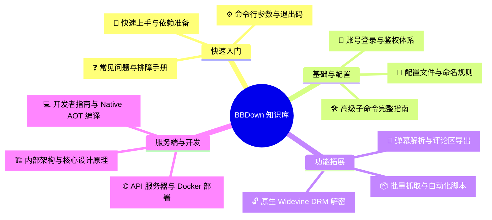

# BBDown 官方知识库 (Wiki)

> 本知识库是 **BBDown**（命令行式哔哩哔哩音视频下载与录制工具）的官方技术参考与使用手册，涵盖从快速入门、全量参数、高级子命令、DRM 解密到底层架构与二次开发的完整内容。

---

## 📚 知识库体系全景

---

## 📑 模块导航目录

### 一、 入门与参考
| 文档 | 说明 | 核心内容 |
| :--- | :--- | :--- |
| 🚀 [快速上手 (Getting Started)](Getting-Started) | 环境准备与基本使用 | 预编译包获取、外部依赖配置（FFmpeg/MP4Box/aria2c）、基础下载指令 |
| ⚙️ [全命令行参数详解 (CLI Reference)](CLI-Reference) | 完整选项字典 | 40+ 参数大表、画质/编码优先级、分 P 选择语法、系统退出码标准 |
| ❓ [常见问题与故障排查 (FAQ)](FAQ-and-Troubleshooting) | 全场景排障指南 | 混流失败处理、403/412 限制应对、Linux 图形库异常修复、`--debug` 抓包 |

### 二、 核心功能与配置
| 文档 | 说明 | 核心内容 |
| :--- | :--- | :--- |
| 🔑 [账号登录与鉴权 (Authentication)](Authentication) | 账号凭据与权限提升 | 网页/TV 端扫码登录、APP Token 抓包提取、Cookie 传递、充电专属防御机制 |
| 📝 [配置文件与命名规则 (Configuration)](Configuration-and-Templates) | 自动化配置与路径模板 | `BBDown.config` 语法、18 种文件名占位符变量、目录分级归档实战 |
| 🛠️ [子命令使用指南 (Subcommands)](Subcommands) | 独立扩展功能集 | 直播录制 (`live`)、专栏文章下载 (`article`)、稍后再看 (`watchlater`)、订阅管理 (`sub`) |

### 三、 进阶特性与自动化
| 文档 | 说明 | 核心内容 |
| :--- | :--- | :--- |
| 💬 [弹幕与评论区抓取 (Danmaku & Comments)](Danmaku-and-Comments) | 文本与互动元数据抓取 | 弹幕 XML / Protobuf 下载、ASS 字幕转换规范、黑名单过滤、评论区 JSON 导出 |
| 📦 [批量下载与自动化 (Batch & Automation)](Batch-and-Automation) | 海量抓取与工程流水线 | UP 主空间全量解析、合集/播单抓取、`--save-archives-to-file` 历史防重、Webhook 回调 |
| 🔓 [Widevine DRM 原生解密 (DRM Decryption)](DRM-Decryption) | 版权与付费课程解密 | 原生 C# CDM 运行机制、`device.wvd` 放置规则、B 站付费课程/保护番剧自动解密 |

### 四、 服务端与源码开发
| 文档 | 说明 | 核心内容 |
| :--- | :--- | :--- |
| 🌐 [API 服务器与 Docker 部署 (API & Docker)](API-Server-and-Docker) | 远程服务与容器化 | RESTful API 规范、并发控制、Token 认证、Docker Compose 一键部署 |
| 🏗️ [内部架构与设计原理 (Architecture)](Architecture-and-Design) | 系统底层实现原理 | 代码分层设计、`FetcherFactory` 责任链、读停滞看门狗、PCDN 自动拦截 |
| 💻 [开发者指南与编译构建 (Developer Guide)](Developer-Guide) | 源码调试与发布 | .NET 10 开发环境、单元测试、Windows/Linux/macOS Native AOT 跨平台独立发布 |

---

## 🔗 相关外部链接

- **代码仓库**：[GitHub - aliveranme/BBDown](https://github.com/aliveranme/BBDown)
- **上游原始仓库**：[GitHub - nilaoda/BBDown](https://github.com/nilaoda/BBDown)
- **版本发布页**：[GitHub Releases](https://github.com/aliveranme/BBDown/releases)
- **问题反馈**：[GitHub Issues](https://github.com/aliveranme/BBDown/issues)
